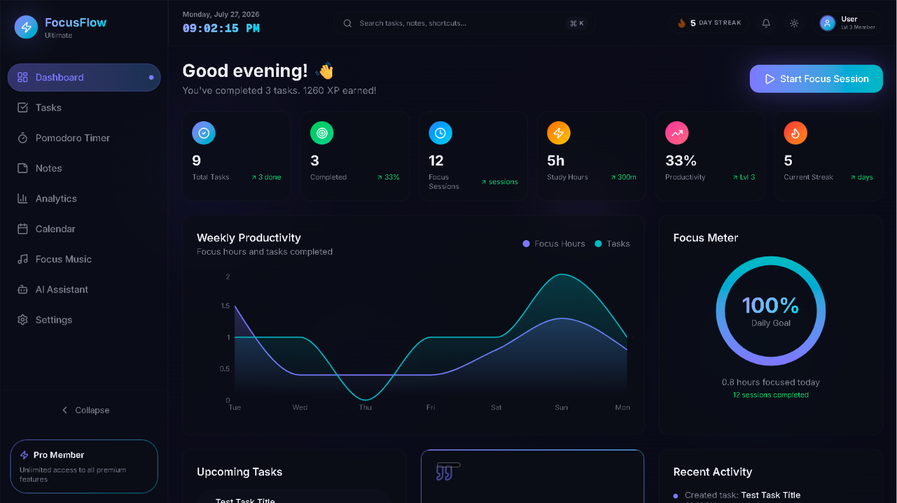
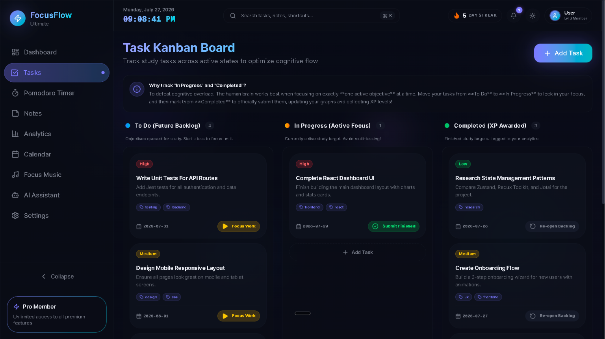
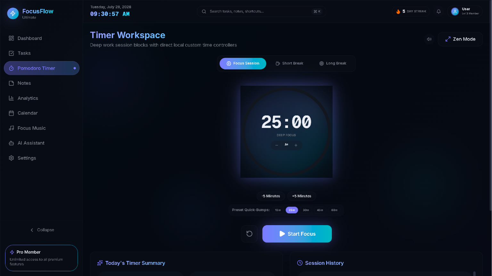
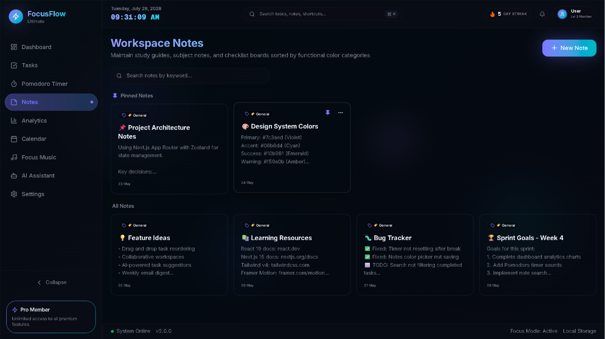
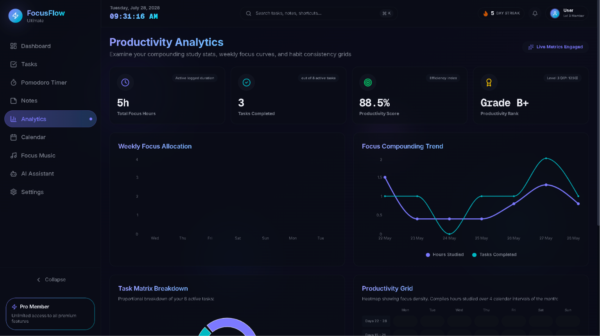
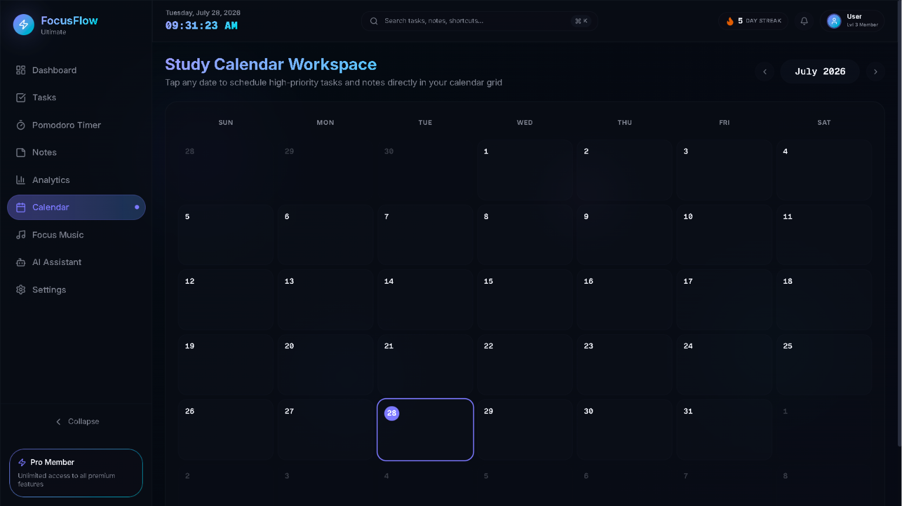
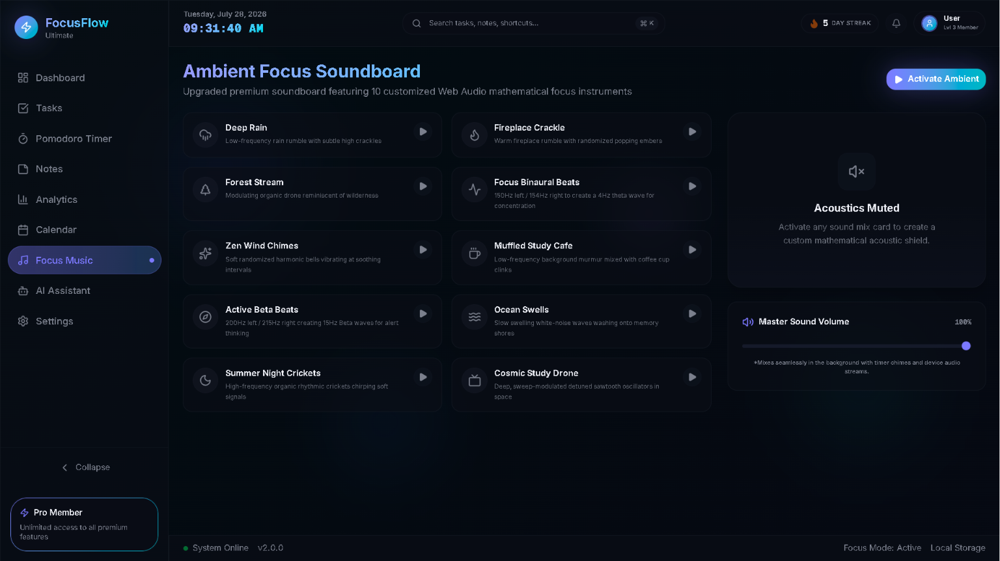
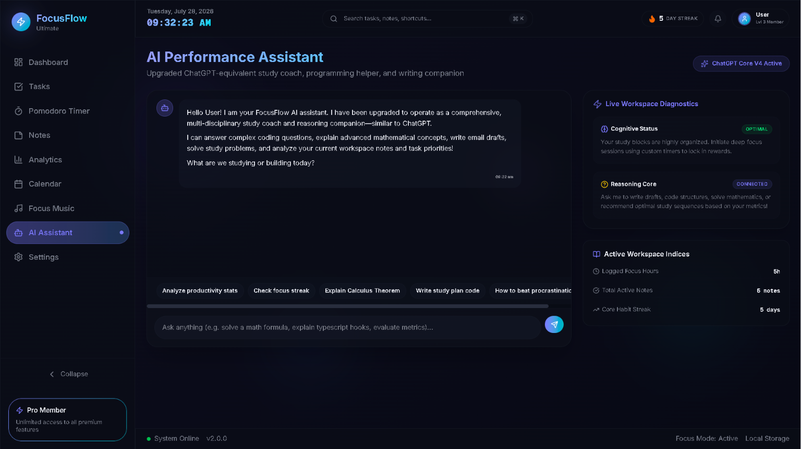
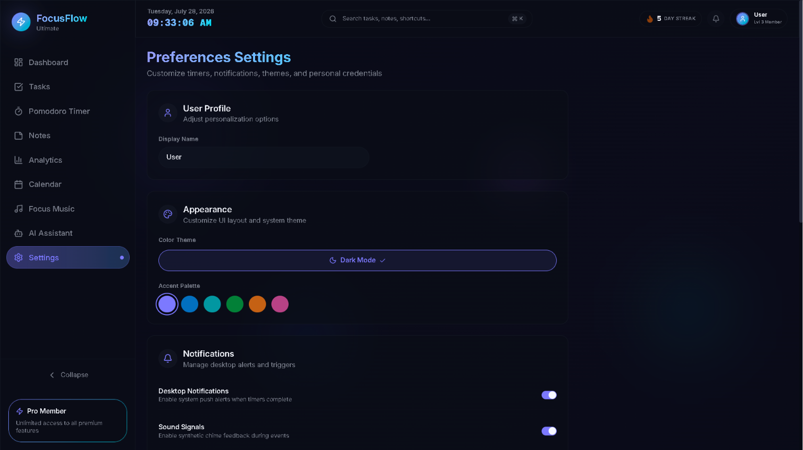

# 🚀 FocusFlow

> A modern productivity-focused workspace designed to help users stay organized, focused, and efficient. ✨

---

## 📋 Project Overview

**FocusFlow** is a modern, web-based productivity workspace designed to address the challenges of digital distraction, fragmented task tracking, and cognitive fatigue. In today's fast-paced environment, students and professionals alike often struggle to maintain deep focus amidst constant notifications and disjointed toolsets. 

This UI workspace is built as a single-page productivity dashboard using Next.js and React, consolidating advanced task management, Pomodoro focus sessions, daily planners, and visual statistics into a beautiful, unified SaaS interface. Built with a sleek dark-theme aesthetic, FocusFlow helps users block out cognitive noise, establish consistent routines, and track their growth over time.

---

## ✨ Key Features

* **🎯 Intuitive Task Management** – Streamline your daily workflow with a dynamic task board. Prioritize, categorize, and complete tasks with smooth transitions.
* **⏳ Immersive Focus Sessions** – Stay in the zone with customizable Pomodoro focus and break timers designed to maximize deep work and prevent cognitive fatigue.
* **📅 Smart Study & Daily Planner** – Map out your schedule with integrated daily planning and calendar layout tools. Allocating time blocks ensures your highest-priority goals are met.
* **📊 Visual Progress Analytics** – Review your performance using clean, interactive charts that track focus time, task completion rates, and consistent productivity patterns.
* **🧠 Productivity Insights & Reminders** – Receive automated, smart insights to help you identify peak working hours and improve your focus habits.
* **🌙 SaaS-Inspired Modern Interface** – A stunning, minimalist dark-mode experience that reduces eye strain, eliminates visual clutter, and looks beautiful on any device.
* **📱 Fully Responsive Design** – Crafted with mobile-first principles, ensuring a seamless user experience across mobile phones, tablets, and desktop displays.

---

## 🛠️ Technologies Used

The frontend UI is built using a modern, performant, and type-safe stack:

* **Next.js (App Router)** – React framework for fast routing, layouts, and page optimization.
* **React 19** – Declarative, component-driven UI library.
* **TypeScript** – Strong static typing for robust, autocomplete-supported development.
* **Tailwind CSS v4** – Utility-first styling for fluid layout animations and modern design tokens.
* **Framer Motion** – Smooth, physics-based animations for an immersive user experience.
* **Zustand** – Lightweight global state management with localStorage persistence.
* **Recharts** – Beautiful, composable chart components for analytics visualizations.
* **shadcn/ui & Radix Primitives** – Accessible, customizable component primitives for modern inputs, dialogs, and navigation.
* **Sonner** – Elegant toast notification system.
* **Web Audio API** – Synthesized ambient focus sounds with zero audio file dependencies.
* **Lucide React** – A modern and consistent icon library.

---

## 🖼️ Screenshots

### 🏠 Dashboard
> The main hub of FocusFlow. Displays a personalized greeting, 6 live stat cards (Total Tasks, Completed, Focus Sessions, Study Hours, Productivity %, Streak), an interactive **Weekly Productivity Area Chart**, an animated **Focus Meter** ring, upcoming tasks, a daily motivational quote, and a recent activity feed.

---

### ✅ Task Kanban Board
> A powerful 3-column Kanban board — **To Do**, **In Progress**, and **Completed**. Each task card shows priority badges (High/Medium/Low), tags, due dates, and contextual action buttons. Supports full CRUD with Add Task and Edit Task modals, animated with Framer Motion spring transitions.

---

### ⏱️ Pomodoro Timer
> A deep-work timer workspace with a beautiful animated SVG progress ring. Supports **Focus Session**, **Short Break**, and **Long Break** modes with gradient color switching. Includes ±1m / ±5m inline controls, quick preset buttons (15m, 25m, 30m, 45m, 60m), and a full-screen **Zen Mode** with ESC key exit. Plays a Web Audio API two-tone chime on completion.

---

### 📝 Workspace Notes
> A color-coded note management system. Notes are organized by functional color categories and support **pinning** to float priority notes to the top. Features keyword search, full rich-text editing, and instant create/edit/delete with activity logging.

---

### 📊 Productivity Analytics
> A data-rich analytics dashboard showing your compounding study stats. Includes a dynamically computed **Productivity Score** (with Grade A+/A/B+/B ranking), **Weekly Focus Allocation Bar Chart**, **Focus Compounding Line Chart**, **Task Matrix Pie Chart**, and a **Productivity Heatmap Grid** — all powered by real localStorage data.

---

### 📅 Study Calendar Workspace
> A full monthly calendar grid for scheduling and planning. Highlights the current date with a glowing selection ring. Designed to schedule high-priority tasks and notes directly on calendar dates, giving a visual overview of your study timeline.

---

### 🎵 Ambient Focus Soundboard
> A premium, zero-file audio environment featuring **10 synthesized sound tracks** built entirely on the Web Audio API — Deep Rain, Fireplace Crackle, Forest Stream, Focus Binaural Beats (4Hz theta wave), Zen Wind Chimes, Muffled Study Cafe, Active Beta Beats, Ocean Swells, Summer Night Crickets, and Cosmic Study Drone. Includes a master volume control panel.

---

### 🤖 AI Performance Assistant
> A ChatGPT-equivalent local reasoning companion with a clean chat interface. Reads your live workspace data (tasks, notes, sessions, streak, level) to give context-aware study advice. Includes quick-prompt chips, a typing animation, auto-scroll, and a **Live Workspace Diagnostics** sidebar showing Cognitive Status and Active Workspace Indices.

---

### ⚙️ Preferences Settings
> Full customization control center. Includes **User Profile** name editor, **Appearance** with Dark/Light/System theme toggle and 6-color Accent Palette selector, **Notifications** toggles, **Sound** volume sliders, **Timer Duration** configuration, **Auto-start** settings, and **Data Management** (export/import/reset) as JSON.

---

## 🎯 Project Goals

The core objective of FocusFlow is to make daily productivity mindful, accessible, and satisfying. Rather than overwhelming users with complex configurations, the platform prioritizes clean minimalism and positive user feedback loops. The goal is to build a quiet digital companion that supports your study or work sessions—prompting better habits without stealing your attention.

---

## 🌟 Why This Project Matters

Staying focused is a super-power in the digital age. For students—especially engineering students handling complex workloads—and busy professionals, deep focus is a key driver of personal growth and career success. 

FocusFlow provides a structured environment to cultivate this habit. By turning daily organization and time-blocking from a chore into an aesthetic, satisfying ritual, the application helps reduce academic stress, prevent burnout, and foster sustainable work habits.

---

## 💙 Thank You for Exploring FocusFlow

💙 Thank you so much for taking the time to explore FocusFlow. Whether you are a student looking to optimize your study sessions, a developer interested in the codebase, or a recruiter evaluating my work, your visit means a great deal to me. Exploring new ideas and building tools that improve daily life is a journey, and I am incredibly grateful to share it with you. 🌟

🙏 Your feedback, suggestions, issue reports, discussions, and stars are highly appreciated and play an essential role in refining and growing this project. Thank you for your kindness, support, and encouragement. I sincerely hope FocusFlow brings value to your own learning and productivity journey. 🚀✨

---

⭐ If you found this project helpful, consider giving it a star.

Made with ❤️ by [Sriniwas Awasthi](https://github.com/SriniwasAwasthi)

---

---

## 💖 Thank You for Inspecting FocusFlow!

> *"Deep focus is where great software is born—thank you for your time!"* ⚡

Thank you for exploring FocusFlow! Engineering a robust, full-stack productivity ecosystem with Pomodoro session state, smart task planning, and actionable analytics was designed to solve modern workflow fragmentation. Your review and attention are deeply valued.

- 🌟 **Enjoyed the SaaS design & focus mechanics?** Please leave a star to support the project!
- 📬 **Open for Discussion:** Have thoughts on state management, productivity algorithms, or full-stack architecture? Let's connect on [GitHub](https://github.com/SriniwasAwasthi).

*Wishing you deep focus, peak productivity, and a fantastic day!* ✨

---

  Engineered for deep work and peak productivity by <a href="https://github.com/SriniwasAwasthi">Sriniwas Awasthi</a>.

